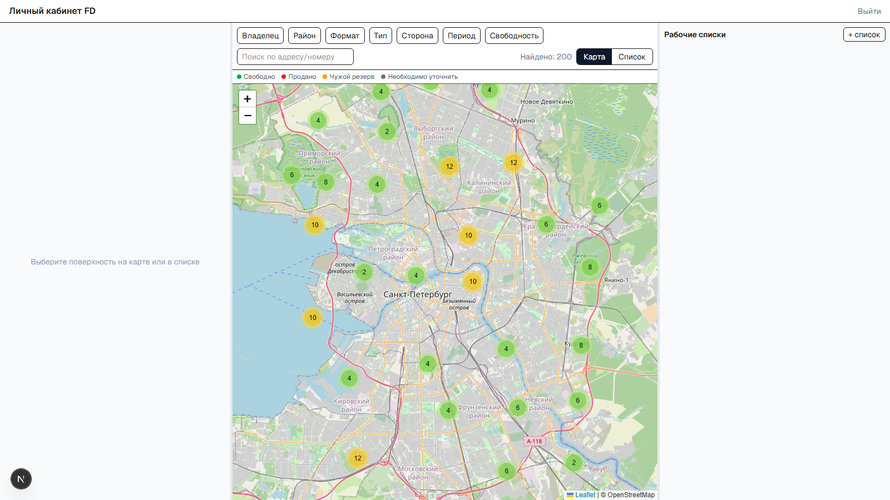
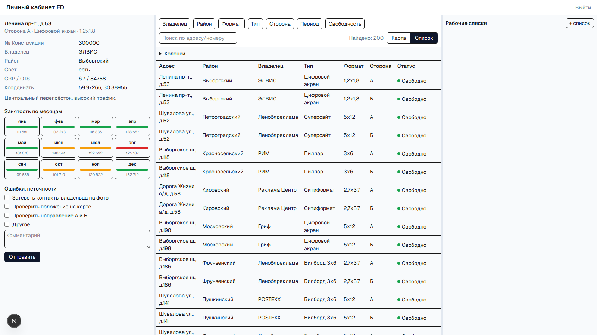
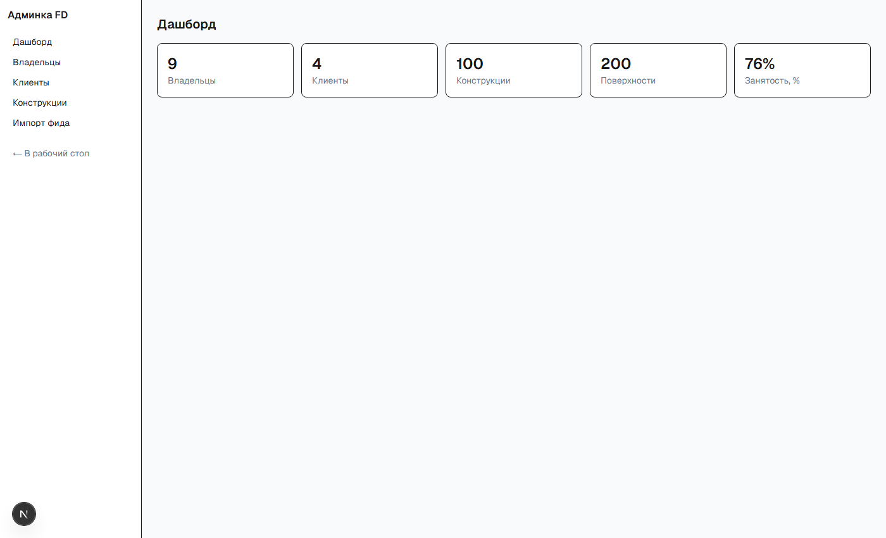

# Личный кабинет FD — демо

Full-stack демо личного кабинета медиаселлера наружной рекламы (OOH). Система
агрегирует рекламные конструкции разных Владельцев и даёт Клиенту-рекламодателю
искать поверхности на карте и в списке, смотреть занятость по месяцам, собирать
рабочие списки и выгружать их в Excel.

> Демо-проект для портфолio на основе реального техзадания. Данные —
> сгенерированные (≈200 поверхностей по Санкт-Петербургу), фото/панорамы —
> плейсхолдеры.

## Скриншоты

Рабочий стол — 3 зоны (карточка стороны · карта/список · рабочие списки):



Карточка стороны с календарём занятости по месяцам и формой правок:



Админка (роль `ADMIN`): дашборд, справочники и импорт фида:



## Возможности

### Кабинет клиента

- **Вход по логину/паролю** (Auth.js, роли `CLIENT`/`ADMIN`), защита маршрутов.
- **3-зонный рабочий стол** с перетаскиваемыми бегунками (react-resizable-panels).
- **Карта** (Leaflet + OpenStreetMap) с кластеризацией маркеров и цветом по статусу;
  опционально — Яндекс.Карты по env-ключу.
- **Фильтры** по владельцу, району, формату, типу, стороне, периоду и свободности
  (состояние отражается в запросе к API).
- **Список** (TanStack Table) с настройкой видимости колонок.
- **Карточка стороны**: реквизиты, GRP/OTS, координаты, **календарь занятости по
  месяцам** (Свободно / Продано / Чужой резерв / Уточнить + цена), форма «Ошибки,
  неточности».
- **Рабочие списки**: создание/переименование/удаление, добавление поверхностей
  по номерам (вставка нескольких ID), «Загрузить на карту», **выгрузка в Excel**.

### Админка (роль `ADMIN`, `/admin`)

- **Дашборд** со статистикой (владельцы, клиенты, конструкции, поверхности, % занятости).
- **Владельцы** — CRUD (с защитой от удаления при наличии конструкций).
- **Клиенты и пользователи** — создание клиента с логином/паролем; новый пользователь
  сразу может войти в кабинет.
- **Конструкции и стороны** — список с поиском/пагинацией, создание, **редактор
  занятости и цен по месяцам** (изменения сразу видны клиенту).
- **Импорт фида** — загрузка нормализованного CSV/XLSX: идемпотентный upsert
  владелец → конструкция → сторона → занятость, лог импортов, отчёт об ошибках строк.
  Формат и пример — см. `docs/samples/feed-sample.csv`.

## Стек

Next.js 16 (App Router, TypeScript) · Prisma 6 + PostgreSQL · Auth.js (NextAuth v5)
· Tailwind CSS · TanStack Table · react-leaflet + leaflet.markercluster · exceljs ·
papaparse · Zod · Vitest · Playwright.

## Быстрый старт (локально)

Требуется Node ≥ 20 и Docker.

```bash
# 1. Зависимости
npm install

# 2. База данных (PostgreSQL в Docker)
docker compose up -d

# 3. Окружение
cp .env.example .env        # при необходимости поменяйте AUTH_SECRET

# 4. Схема и демо-данные
npx prisma migrate dev
npm run db:seed

# 5. Запуск
npm run dev                 # http://localhost:3000
```

### Демо-доступы (на странице входа — кнопки в один клик)

| Роль    | Логин         | Пароль     |
|---------|---------------|------------|
| Клиент  | `client@demo` | `demo1234` |
| Админ   | `admin@demo`  | `demo1234` |

## Карта: OpenStreetMap или Яндекс

По умолчанию используется бесплатный Leaflet + OpenStreetMap (без ключа —
работает сразу). Чтобы переключиться на Яндекс.Карты (с панорамами), задайте в
`.env`:

```
NEXT_PUBLIC_YANDEX_API_KEY="ваш-ключ"
```

Ключ получается бесплатно в кабинете разработчика Яндекса (JS API 3.0,
25 000 запросов/день). Выбор провайдера — автоматически по наличию ключа.

## Тесты

```bash
npm test     # unit (Vitest): занятость, фильтры, парсер ID, экспорт, парсер фида
npm run e2e  # e2e (Playwright): клиентский путь + доступ к админке
```

## Деплой

Рекомендуется Vercel + управляемый PostgreSQL (Neon / Vercel Postgres):

1. Задайте переменные окружения: `DATABASE_URL`, `AUTH_SECRET`
   (и опционально `NEXT_PUBLIC_YANDEX_API_KEY`).
2. Примените миграции к боевой БД: `npx prisma migrate deploy`.
3. Заполните демо-данными: `npm run db:seed`.

## Структура

```
prisma/                 # схема, миграции, seed
src/lib/domain/         # чистая бизнес-логика (покрыта unit-тестами: занятость, фильтры, ID, экспорт, фид)
src/lib/map/            # адаптер карты (Leaflet по умолчанию, Yandex опционально)
src/lib/admin/          # серверные хелперы админки (guard, stats, api-guard)
src/app/api/            # REST-эндпоинты клиента (surfaces, working-lists, error-reports, auth)
src/app/api/admin/      # REST-эндпоинты админки (owners, clients, constructions, surfaces, feed-import)
src/app/workspace/      # рабочий стол клиента
src/app/admin/          # админ-панель (дашборд, справочники, импорт)
src/components/          # workspace/* и admin/* компоненты
tests/                  # unit (Vitest) + e2e (Playwright)
```

## Дальнейшее развитие

Оба этапа реализованы: **План 1** — кабинет клиента, **План 2** — админка и импорт
фидов (см. `docs/superpowers/plans/`). Возможные направления: отправка отчётов об
ошибках на почту, ролевая модель менеджеров, реальные фото/панорамы, аналитика.
