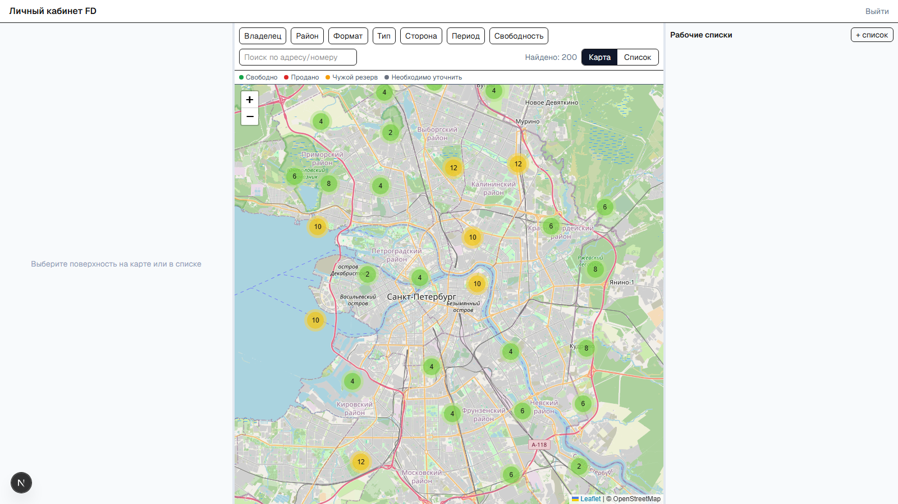
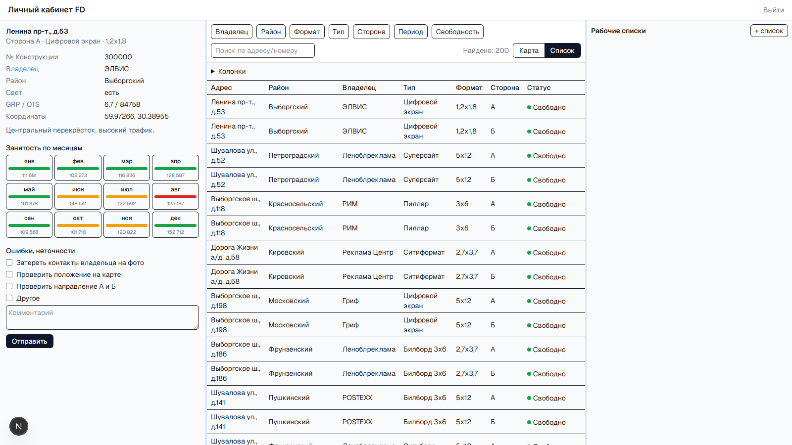
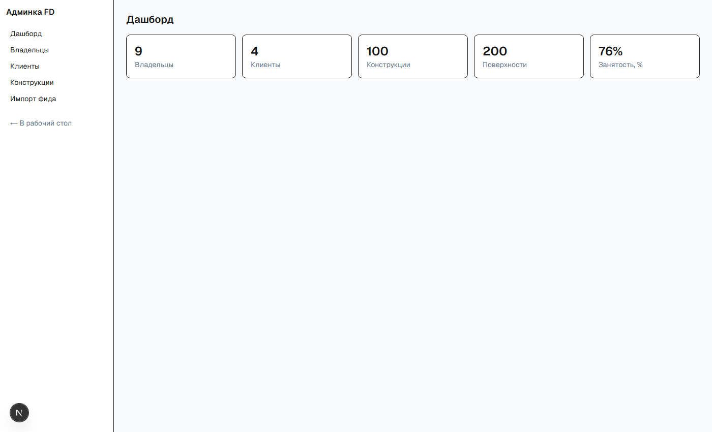

# LK FD — Client Portal Demo

**A full-stack demo of a client portal for an out-of-home (OOH) advertising media seller:** an interactive placement map, ad surface selection, monthly availability, working lists with Excel export, and an admin panel with feed import.


[](https://github.com/denfry/lk-fd-demo/actions/workflows/ci.yml)




> A portfolio project based on a real client brief. All data is generated (about 200 ad surfaces in Saint Petersburg) and photos/panoramas are placeholders. The map works out of the box on OpenStreetMap and needs no API keys.
>
> The application UI is in Russian.

## Demo accounts

The `/login` page has one-click buttons to sign in as a client or as an admin. The same credentials work manually:

| Role   | Login         | Password   |
|--------|---------------|------------|
| Client | `client@demo` | `demo1234` |
| Admin  | `admin@demo`  | `demo1234` |

These accounts exist only in the seeded demo database. Do not use them in a real deployment.

## Screenshots

Surface card with the monthly availability calendar and the corrections form:



Admin panel (`ADMIN` role): dashboard, reference data and feed import:



## Features

### Client workspace

- **Login with email and password** (Auth.js, `CLIENT` / `ADMIN` roles) and protected routes.
- **Three-zone workspace** with draggable splitters (react-resizable-panels).
- **Map** (Leaflet + OpenStreetMap) with marker clustering and status colors; Yandex Maps is optional via an environment key.
- **Filters** by owner, district, format, type, side, period and availability; the filter state is reflected in the API request.
- **List view** (TanStack Table) with configurable column visibility.
- **Surface card:** details, GRP/OTS, coordinates, a **monthly availability calendar** (Free / Sold / Reserved by others / Needs check, with price) and an "errors and inaccuracies" report form.
- **Working lists:** create, rename and delete lists; add surfaces by ID (paste several at once); load a list onto the map; **export to Excel**.

### Admin panel (`ADMIN` role, `/admin`)

- **Dashboard** with statistics: owners, clients, constructions, surfaces, occupancy percentage.
- **Owners:** CRUD, with deletion blocked while an owner still has constructions.
- **Clients and users:** create a client with a login and password; the new user can sign in immediately.
- **Constructions and surfaces:** searchable, paginated list; creation; an **availability and price editor by month** (changes are visible to clients immediately).
- **Feed import:** upload a normalized CSV or XLSX file. The import is an idempotent upsert of owner, construction, surface and availability, with an import log and a per-row error report. See `docs/samples/feed-sample.csv` for the format.

## Tech stack

Next.js 16 (App Router, TypeScript) · Prisma 6 + PostgreSQL · Auth.js (NextAuth v5) · Tailwind CSS · TanStack Table · react-leaflet + leaflet.markercluster · exceljs · papaparse · Zod · Vitest · Playwright.

## Quick start

Requires Node.js 20 or newer and Docker.

```bash
# 1. Dependencies
npm install

# 2. Database (PostgreSQL in Docker)
docker compose up -d

# 3. Environment
cp .env.example .env        # PowerShell: Copy-Item .env.example .env

# 4. Schema and demo data
npx prisma migrate dev
npm run db:seed

# 5. Run
npm run dev                 # http://localhost:3000
```

## Configuration

Environment variables (see `.env.example`):

| Variable | Description |
|----------|-------------|
| `DATABASE_URL` | PostgreSQL connection string. The default matches `docker-compose.yml`. |
| `AUTH_SECRET` | Auth.js secret. Replace the placeholder outside local development. |
| `NEXT_PUBLIC_YANDEX_API_KEY` | Optional. Switches the map from OpenStreetMap to Yandex Maps. |

### Map provider: OpenStreetMap or Yandex

By default the app uses Leaflet with OpenStreetMap, which needs no key. To switch to Yandex Maps (with panoramas), set the key in `.env`:

```
NEXT_PUBLIC_YANDEX_API_KEY="your-key"
```

A key can be obtained for free in the Yandex developer console (JS API 3.0, 25,000 requests per day). The provider is chosen automatically depending on whether the key is set.

## Testing

```bash
npm test      # unit tests (Vitest): availability, filters, ID paste parser, export, feed parser
npm run e2e   # end-to-end tests (Playwright): client flow and admin access
npm run lint  # ESLint
```

CI (`.github/workflows/ci.yml`) runs `npm ci`, Prisma client generation, lint, unit tests and a production build on every push and pull request to `master`.

## Deployment

The project is designed for Vercel with a managed PostgreSQL database (Neon or Vercel Postgres):

[](https://vercel.com/new/clone?repository-url=https://github.com/denfry/lk-fd-demo)

1. Create a database (for example on Neon) and set `DATABASE_URL` and `AUTH_SECRET`, plus `NEXT_PUBLIC_YANDEX_API_KEY` if needed.
2. Apply migrations to the production database: `npx prisma migrate deploy`.
3. Load the demo data: `npm run db:seed`.

## Project layout

```
prisma/                 # schema, migrations, seed
src/lib/domain/         # pure business logic, unit-tested: availability, filters, ID parsing, export, feed
src/lib/map/            # map adapter (Leaflet by default, Yandex optional)
src/lib/admin/          # admin server helpers (guard, stats, api-guard)
src/app/api/            # client REST endpoints (surfaces, working-lists, error-reports, auth)
src/app/api/admin/      # admin REST endpoints (owners, clients, constructions, surfaces, feed-import)
src/app/workspace/      # client workspace
src/app/admin/          # admin panel (dashboard, reference data, import)
src/components/         # workspace/* and admin/* components
tests/                  # unit (Vitest) and e2e (Playwright)
docs/                   # design spec, implementation plans, sample feed, screenshots
```

## Status and roadmap

Both planned stages are implemented: the client workspace and the admin panel with feed import (see `docs/plans/`). Possible next steps: emailing error reports, a manager role model, real photos and panoramas, analytics.

## License

[MIT](LICENSE)
